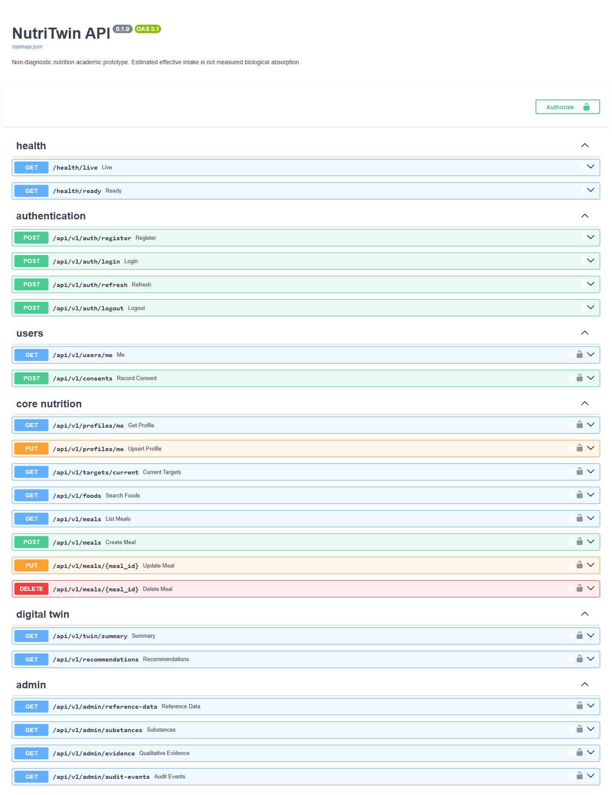
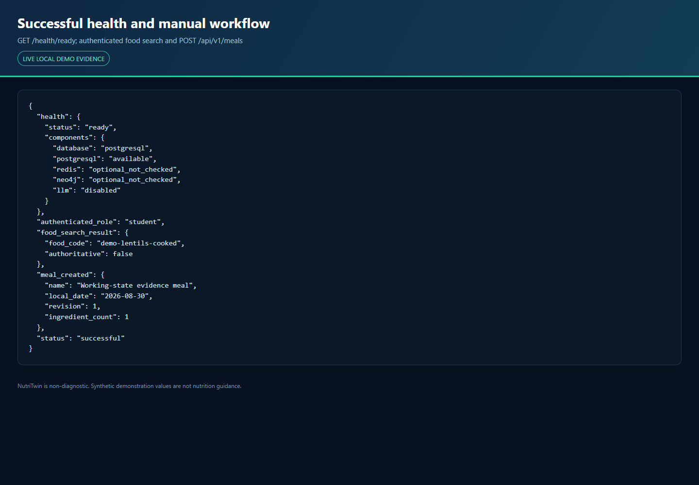
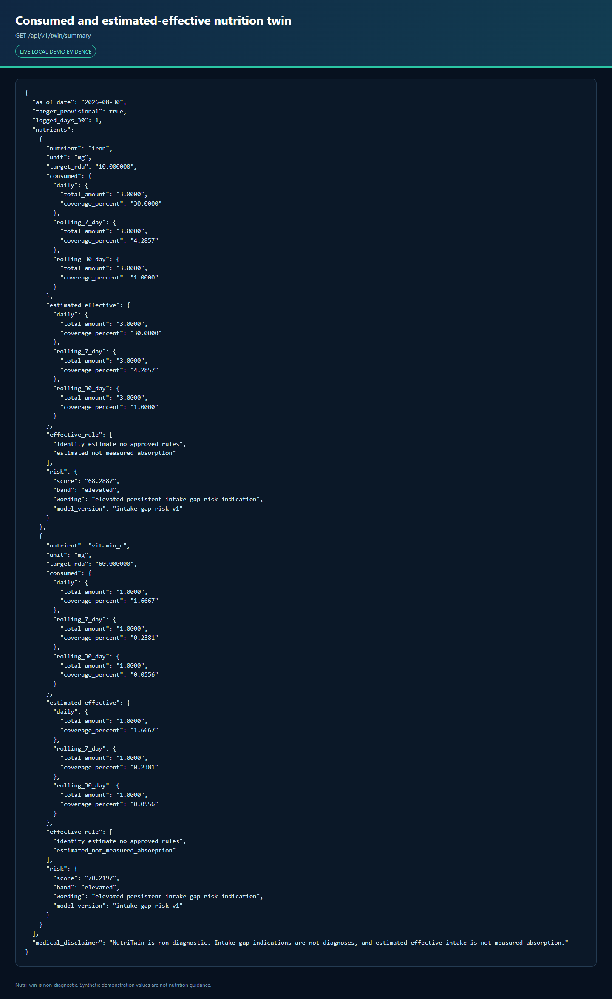
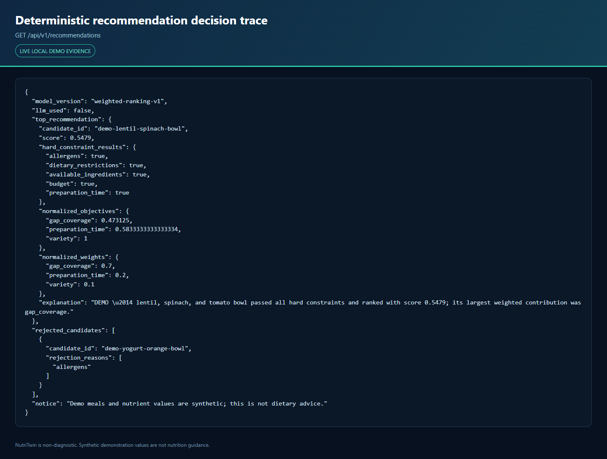
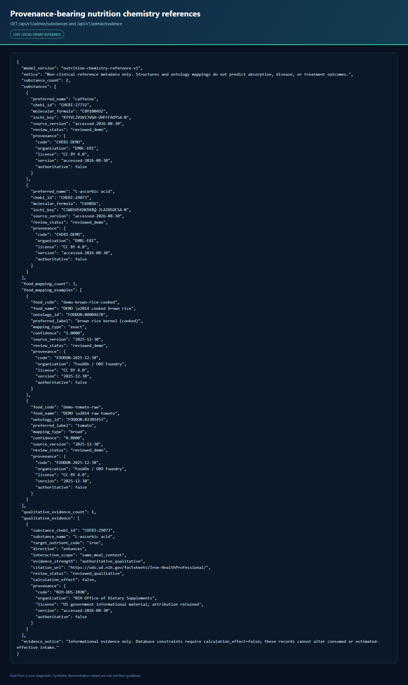
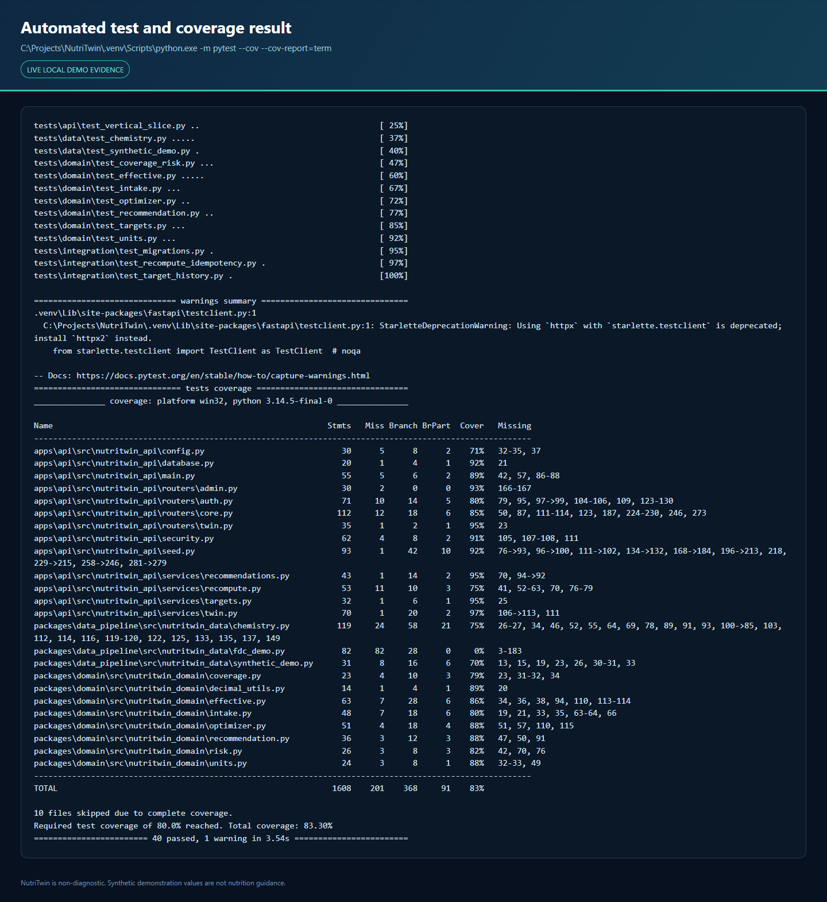
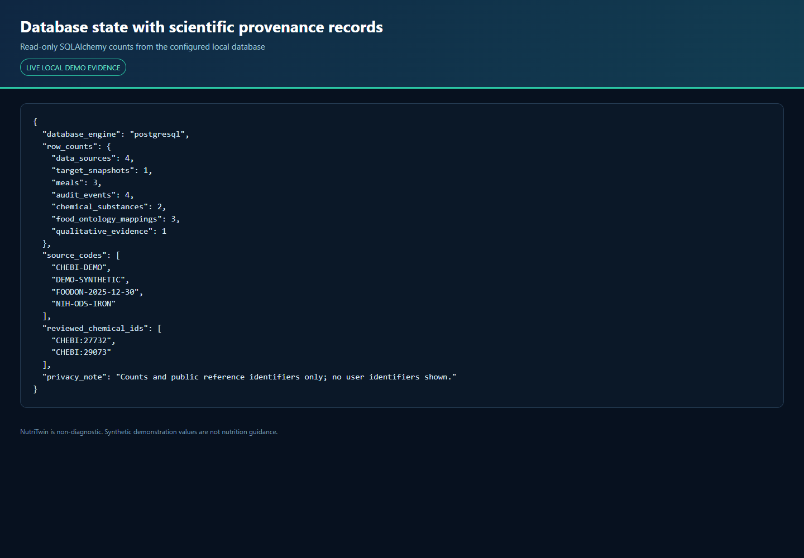

# NutriTwin

NutriTwin is an explainable, non-clinical personalized-nutrition digital-twin academic prototype for Indian dietary contexts. It keeps logged consumed intake, estimated effective intake, reference targets, persistent intake-gap indications, and future simulations as distinct concepts.

> **Safety:** NutriTwin is educational research software. It does not diagnose nutrient deficiency or disease, measure biological absorption, prescribe supplements, or recommend medication changes. Seek a qualified professional for medical or dietary care.

## What works now

The verified backend vertical slice supports Student, Adult, and Admin accounts; consent; versioned profiles and target snapshots; curated food search; ingredient-level meal create/edit/delete; consumed and separately estimated-effective nutrient totals; daily, rolling 7-day, and rolling 30-day coverage; deterministic intake-gap risk traces; hard-constraint-aware weighted meal ranking; and deterministic explanations. The workflow runs with the LLM, Neo4j, OCR, barcode, image recognition, and external prices disabled.

The API foundation also includes Argon2 password hashing, short-lived JWT access tokens, rotating/revocable hashed refresh sessions, backend RBAC, audit events, structured request logging, Alembic migrations, an idempotent Celery recomputation job, Docker Compose, and CI checks. The bounded chemistry layer adds reviewed ChEBI substances, FoodOn mappings, calculation-inactive qualitative interaction evidence, and optional RDKit structure validation. It does not predict absorption or make medical claims.

Authoritative ICMR-NIN tables are **not bundled** because redistribution permission has not been established. The included seven-food/four-nutrient dataset and target rules are conspicuously synthetic and validate software behavior only. They are not nutrition guidance and do not scientifically validate the model.

| Area | Status |
|---|---|
| FastAPI modular monolith and OpenAPI | Implemented and locally verified |
| Pure targets/intake/effective/coverage/risk/ranking/CP-SAT domain logic | Implemented and tested |
| PostgreSQL schema and Alembic migrations | Implemented; migrations also verified against SQLite locally |
| Redis/Celery recomputation | Implemented and unit/integration tested; clean live Compose validation recorded in the validation report |
| ChEBI/FoodOn chemistry and provenance inspection | Implemented for two substances and three demo-food mappings; Admin read-only APIs tested |
| RDKit structure consistency validation | Implemented as an optional, pinned data-pipeline dependency |
| Synthetic demo pipeline and automated HTTP walkthrough | Implemented and verified |
| Licensed ICMR-NIN/IFCT import and scientific golden cases | Blocked on lawful source access/permission |
| Quantitative absorption modifiers | Deferred pending evidence review; identity-estimate baseline implemented |
| Neo4j evidence graph and Admin authoring | Deferred; core is independent of it |
| Flutter, pantry/grocery, what-if, research export | Deferred |
| OCR, vision, barcode, external prices, LLM adapter, Next.js, Kubernetes, deployment | Deferred |

## Architecture

```text
Flutter client (primary; deferred)
                 |
        FastAPI modular monolith
 auth | profiles | foods | meals | twin | recommendations | admin-read
                 |
     pure deterministic domain package
                 |
 PostgreSQL (authoritative history)
      | optional Redis/Celery      optional Neo4j/LLM
```

The complete provisional specification is [docs/NUTRITWIN_SPEC.md](docs/NUTRITWIN_SPEC.md), the architecture is [docs/ARCHITECTURE.md](docs/ARCHITECTURE.md), calculation formulas are [docs/ALGORITHM_SPECIFICATION.md](docs/ALGORITHM_SPECIFICATION.md), and requirement status is [docs/REQUIREMENTS_TRACEABILITY_MATRIX.md](docs/REQUIREMENTS_TRACEABILITY_MATRIX.md).

## Quick start with Docker Compose

Prerequisites are Git and a functioning Docker Desktop/Engine. No paid service or external API key is needed.

```bash
make up
make demo
make down
```

The API is at `http://127.0.0.1:8000`; interactive OpenAPI documentation is at `http://127.0.0.1:8000/docs`. Compose publishes only loopback ports. Its credentials are local-development defaults and must be replaced outside local use.

On the validation machine, Docker Desktop 4.76 initially failed on stale Windows AF_UNIX runtime sockets. The exact stale runtime directories were preserved under timestamped recovery names, Docker recreated them, and engine 29.5.2 became healthy. No factory reset or Docker data deletion was used. Exact Compose results are recorded in the validation report.

## Local-process quick start

Windows PowerShell:

```powershell
python -m venv .venv
.venv\Scripts\python.exe -m pip install -r requirements.lock
.venv\Scripts\python.exe -m pip install --no-deps -e .
.venv\Scripts\alembic.exe upgrade head
.venv\Scripts\python.exe scripts\seed.py
.venv\Scripts\uvicorn.exe nutritwin_api.main:app --host 127.0.0.1 --port 8000
```

In a second terminal:

```powershell
.venv\Scripts\python.exe scripts\demo.py
```

The default local database is `nutritwin-dev.db` and is ignored by Git. Set values from `.env.example` to use PostgreSQL or other local services. Unix developers can override `VENV_PYTHON=.venv/bin/python` and `VENV_BIN=.venv/bin` when using the Makefile.

## Developer commands

```bash
make bootstrap
make bootstrap-research
make up
make migrate
make seed
make test
make lint
make typecheck
make validate-data
make validate-chem
make demo
make down
```

Exact commands and observed results are recorded in [docs/VALIDATION_REPORT.md](docs/VALIDATION_REPORT.md). The manual/API walkthrough is [docs/DEMO_WALKTHROUGH.md](docs/DEMO_WALKTHROUGH.md).

## Working-state evidence

The following images are generated from a running local application by `scripts/capture_review_evidence.py`. They use demo-only data and omit credentials, tokens, connection strings, and personal information. `docs/review1/evidence/manifest.json` binds every image to its source command or endpoint, timestamp, application commit, caption, alternative text, and SHA-256 checksum.

### API interface



*Live Swagger UI for the implemented authentication, consent, profile, food, meal, twin, recommendation, and Admin endpoint groups.*

### Health and authenticated workflow



*Readiness and authenticated Student workflow captured from the local API.*

### Nutrition twin



*Consumed intake, identity-baseline estimated-effective intake, target values, rolling coverage, and non-diagnostic risk trace remain distinct.*

### Recommendation trace



*Accepted and rejected candidate traces with deterministic scoring and explanation; `llm_used` remains false.*

### Chemistry evidence



*Admin-only ChEBI/FoodOn inspection with provenance and explicit `calculation_effect=false`.*

### Automated tests



*Passing tests and coverage from the evidence commit.*

### Database state



*Secret-safe aggregate database state using local demo data only.*

## Academic review artifact

The consolidated project report is [docs/review1/NutriTwin_Project_Review1_Report.docx](docs/review1/NutriTwin_Project_Review1_Report.docx). It covers only the currently implemented foundation, vertical slice, and bounded chemistry-evidence layer; later-scope features are identified only as future work. It identifies K. Sarthak (24BDS1121) as the sole project member. The report embeds the seven commit-bound images above and is structurally, accessibility, and visually checked as described in the validation report.

## Local demo accounts

| Role | Email | Password |
|---|---|---|
| Student | `student@example.com` | `StudentDemo!2026` |
| Adult | `adult@example.com` | `AdultDemo!2026` |
| Admin | `admin@example.com` | `AdminDemo!2026` |

These credentials exist only in seeded local demo data. Do not reuse them or expose this configuration publicly.

## Data provenance

- ICMR-NIN RDA/EAR 2020 remains the required authority for real Indian targets.
- IFCT 2017 is the preferred Indian food-composition source.
- Restricted publications belong in ignored local input directories and require checksum-recorded acquisition/import.
- The optional USDA FoodData Central importer targets CC0 gap/demo records, but the latest unauthenticated acquisition attempt was rate-limited and no FDC records are bundled.
- ChEBI (CC BY 4.0) supplies the two demonstration chemical identifiers/structures; FoodOn (CC BY 4.0) supplies three reviewed demo-food ontology mappings.
- NIH ODS evidence is qualitative and informational in the current implementation; the database and validator prevent it from changing nutrient calculations.
- Missing nutrient values remain missing; an absent value is never silently converted to zero.

See [docs/DATA_SOURCE_REGISTER.md](docs/DATA_SOURCE_REGISTER.md) for source, license, extraction, transformation, and limitation details, and [THIRD_PARTY_NOTICES.md](THIRD_PARTY_NOTICES.md) for pinned open-source/resource notices.

## Repository layout

```text
apps/api/                 FastAPI application and Alembic migrations
apps/mobile/              Flutter implementation contract (deferred)
packages/domain/          Pure deterministic nutrition and optimization logic
packages/data_pipeline/   Reproducible demo/source acquisition validation
services/worker/          Celery task entry point
data/processed/           Legally redistributable generated demo data
infra/docker/             Local reproducible service topology
tests/                    Domain, API, pipeline, migration and job tests
docs/                     Science, architecture, security and validation records
```

## License

No project license has been selected by the user. Until one is added, all rights in repository-authored material remain with the repository owner. Third-party data and citations retain their own terms.
